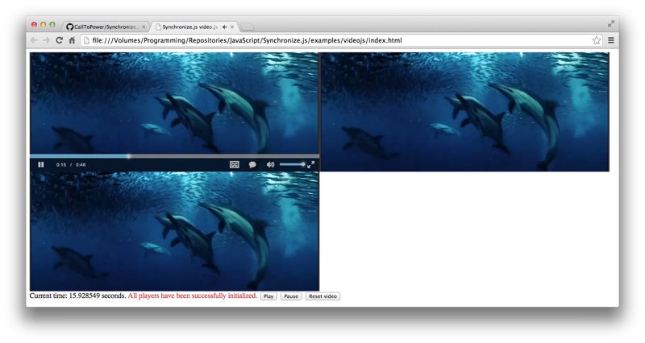

Synchronize.js
==============

A library for synchronizing multiple HTML5 video elements.
Implemented as a jQuery [1] plugin.
Works with plain HTML5 video elements and with video.js [2] when video.js has been detected.

Copyright 2013-2014 Denis Meyer (for more information visit [3])

---
[1] http://jquery.com,
[2] http://www.videojs.com,
[3] http://choosealicense.com/licenses [No License]

Version
-------
1.1.3

Screenshot
----------


Browser support
---------------

Fully supported (and successfully tested):

- Firefox
	- 25 `W, M, L`
	- 25-30 `M`
- Safari
	- 7 `M`
- Google Chrome
	- 27-31 `W`
	- 27-35 `M`
- Chromium
	- 27 `L`
	- 27-36 `M`
- Opera
	- 15-18 `W, M`


Not tested (yet):

- Firefox
	- 26+ `W, L`
- Google Chrome
	- 32+ `W`
- Chromium
	- 28+ `L`
- Opera
	- 19+ `W, M`


Not fully supported:

- Internet Explorer (crashes with video.js videos on page-load -- plain HTML5 works fine!)
	- 11 `W`
- Opera (videos lag)
	- 12 `W, M, L`

---
Mentioned operating systems:
`W`indows 7+,
`M`ac OS X 10.6+,
`L`inux (Ubuntu 12+, CentOS 5+)

Attention
---------
- Chrome/Chromium and Opera (15+) [4] only initialize all video displays properly when the video sources are different per video tag [5, 6]

---
[4] All browsers with the blink engine ( http://www.chromium.org/blink ),
[5] see 'example/index_sameVideoSources.html',
[6] Chromium bug tracker: https://code.google.com/p/chromium/issues/detail?id=326593

Usage
-----

To synchronize multiple videos you have to call one function:
The first parameter is the number of the master video number (parameter 1 = 0, parameter 2 = 1, ...), the following parameter/s varies/vary:

1. The second parameter is a mediagroup ID:
```
$.synchronizeVideos(masterVideoNumber, mediagroup);
```
Note: To use mediagroups there has to be just 2 parameters.

2. The following parameter(s) is a (are) video ID(s):
```
$.synchronizeVideos(masterVideoNumber, videoId1, videoId2, ... , videoIdN);
```

Synchronize.js provides triggers to listen to and listeners to subscribe to.
An event documentation can be found at [7].
Subscribe to Synchronize.js events, e.g.:
```
$(document).on("sjs:allPlayersReady", function(event) {
    // All players have been successfully initialized - do something!
});
```
Trigger Synchronize.js events, e.g.:
```
$("#myPlayButton").click(function () {
    $(document).trigger("sjs:play", []);
});
```

---
[7] https://github.com/CallToPower/Synchronize.js/blob/master/EVENTS.md

Example
-------

More detailed examples (plain HTML5 and video.js) can be found under "release/examples" after checking out this repository.

### JavaScript:

```
$(document).ready(function() {
	$(document).on("sjs:allPlayersReady", function(event) {
		// All players have been successfully initialized - do something!
	});
	
	// set videoId1 (parameter 1 = 0) as master
	
	// 1. Synchronize via mediagroup
	$.synchronizeVideos(0, "mg1");
	
	// 2. Synchronize via IDs
	$.synchronizeVideos(0, "example_video_1", "example_video_2", "example_video_3");
}
```

### HTML:

```
<video id="example_video_1" controls width="640" height="264" mediagroup="mg1">
	<source src="videos/video_1.mp4" type='video/mp4' />
	<source src="videos/video_1.webm" type='video/webm' />
	<source src="videos/video_1.ogv" type='video/ogg' />
</video>
<video id="example_video_2" controls width="640" height="264" mediagroup="mg1">
	<source src="videos/video_2.mp4" type='video/mp4' />
	<source src="videos/video_2.webm" type='video/webm' />
	<source src="videos/video_2.ogv" type='video/ogg' />
</video>
<video id="example_video_3" controls width="640" height="264" mediagroup="mg1">
	<source src="videos/video_3.mp4" type='video/mp4' />
	<source src="videos/video_3.webm" type='video/webm' />
	<source src="videos/video_3.ogv" type='video/ogg' />
</video>
```
